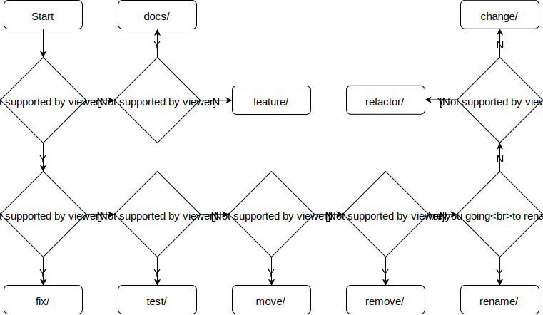

# Git Guide

## Branch names

All branch names must be in the following format:

`<type>/<scope>`

### Type

Must be one of the following:

* **feature**: When adding a new feature or something that has a meaning and didn't exist before.
* **fix**: When fixing something broken. It can be anything from small typo to a huge piece of code that breaks the whole project.
* **test**: Everything related to tests.
* **docs**: When adding or improving the documentation.
* **move**: When moving code from one place to another.
* **remove**: When removing code or documentation that is no longer needed.
* **rename**: When changing the name of something (variable, class, function, etc.)
* **refactor**: When the change only aims to introduce better readability and maintainability of the code without affecting the overall behaviour.
* **change**: All kind of minor changes that don't introduce a new feature and don't fit in the categories above. Examples include changing a default value, adding small performance improvements, etc.

The following flowchart will help you decide which type to use:

\
[HTML version](naming-guide.html)

### Scope

Describes the part of the code affected by the commits inside the branch. Should be a name of a module, component, file or any other logical unit.

### Branch name examples

_feature/sign-in-page_ \
_change/side-menu_ \
_test/profile-page_

## Commits

All commit messages (both the summary line and the description) should be in an imperative mood and should  preferably start
with one of the following verbs:

* **Add**: When adding something new (features, tests, docs, components, variables and even comments).
* **Fix**: When fixing a broken module.
* **Move**: When moving code from one place to another.
* **Remove**: When removing code (unused imports, variables, components, etc).
* **Rename**: When you're renaming something.
* **Refactor**: When you restructure existing code.
* **Change**: When changing something that already exists without adding a feature or fixing a bug.

Other verbs are also allowed if none from the list above suits your needs, but it should be a rare case.

If your commit contains two or more verbs, perhaps you are doing something wrong and the changes should be separated into multiple commits.

If your commit requires additional description, add it to the commit message with a single blank line between the title and the description.

It is optional but yet highly advisable to include in the commit message the name of the component or the file that was edited.

### Commit examples

_Add SignInPage_ \
_Change color variables in variables.scss_ \
_Fix broken SubscriptionPage link_ \
_Remove unnecessary item variable from NewsFeed component_

## Pull requests / Merge requests

All pull or merge request titles (depends on the git platform used) must follow the pattern:

`#<task number> <type>: <description> `

The placeholder _task_number_ should be filled in with the Issue/Task number. Its format may vary depending on the issue tracker used for the project. The type follows the same rules applied during branch naming. The description is similar to the commit messages but usually doesn't relate to a single commit. It is a brief description of the changes. In cases when the PR/MR consists of a single commit, the description may be the commit message itself.

If the pull request is still to be approved by product owner or manager, mark it by adding `AA:` flag in front. If some additional changes are required, use `WIP:` flag.

## Project branches

Each project has a single central repository where its code is stored. Two main branches exist there with an infinite lifetime which means that they should never be deleted (no exceptions).

### The **master** branch

This is the main branch of the project. It should represent the state of the production environment. Merging something in master is an irreversible process. History rewrites here are absolutely forbidden. What goes into master, stays into master. And can only be removed with additional commits. Once merged, the changes should immediately be deployed to the production server. Diverging the master branch from the production environment may cause potentially devastating consequences.

### The **develop** branch

This is the main development branch and it represents the state of our internal development servers. All changes are first deployed here to be reviewed and tested. Two different approaches are possible here.

#### Always ahead approach

All changes are merged into the _develop_ branch with PR or MR. No manual merges here. Everything needs to be reviewed and approved before merging. The develop branch represents the future state of our production environment. Once we are ready to release, the develop branch is merged into master introducing all the changes. Develop will always be ahead of master.

##### Workflow

1. When you are about to develop a new feature, fix or whatever you should always branch out from the latest _develop_ branch. Don't forget to pull before branching.
1. Once you are ready and your branch is pushed to the remote repository, create a pull request for your branch targeting _develop_.
1. When the PR is reviewed and approved, update project's testing environment.
1. Once the whole team is ready for the new release and all planned changes are in _develop_, create another pull request from _develop_ towards _master_. Additionally you can tag the new version using semantic or calendar-based versioning.

#### Separated forever approach

All changes are manually merged into _develop_ branch and deployed on our internal development servers. Once they are approved a PR or MR is created proposing the merge into _master_. The _develop_ branch itself is never merged into _master_. Both communicate only via the changes introduced in both branches. It is a rare case but sometimes master can be merged into develop to apply hotfixes that bypassed it for some reason.

Just like master, develop is updated only with merges but manual not via Pull requests. Direct commits to develop are absolutely forbidden.

##### Workflow

1. When you are about to develop a new feature, fix or whatever you should always branch out from the latest *master* branch. Don't forget to pull before branching.
1. Once you are ready and your branch is pushed to the remote repository, merge your changes to the *develop* branch. Again, don't forget to pull latest changes in develop before that.
1. Push the newly updated *develop* branch and update the project's testing environment. If you don't have the rights to do so, ask a colleague for assistance.
1. Create a pull request for your branch targeting master.

## Ignoring files

The git repository should contain only the source files. The minimum required to run the project. For example, if your project uses Sass or LESS which is later compiled into CSS, you should commit only the source Sass and LESS files without the resulting CSS.

The following rules should be applied:
* Don't commit processed files - If your project uses Sass or LESS files which are later compiled into CSS, you should commit only the source Sass and LESS files without the resulting CSS.
* Don't commit dependencies - Directories containing dependencies such as _node_modules_ have no place in the repository.
* Don't commit editor settings - Despite some settings being standartized in the company, many are not and you should not enforce your own preferences over the whole project.
